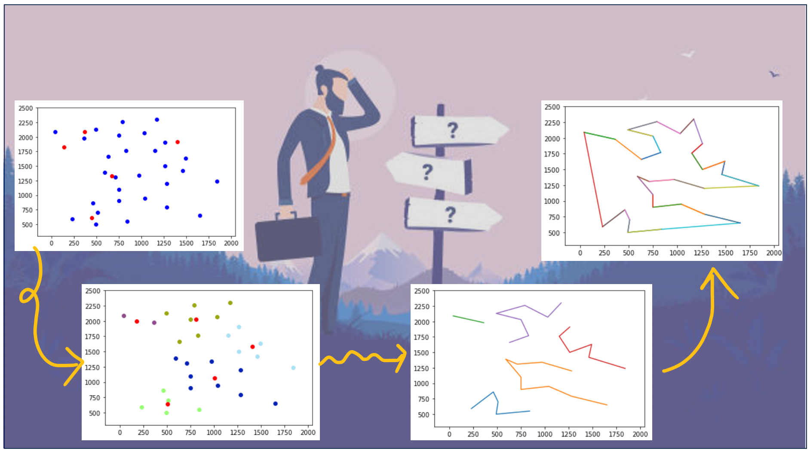

# Self-Organizing Map for the Traveling Salesman Problem (TSP)

## Overview

This project implements a Self-Organizing Map (SOM) to solve the Traveling Salesman Problem (TSP). SOM is an unsupervised machine learning technique used for clustering and dimensionality reduction. In this case, it's adapted to find an approximate solution to TSP.

The TSP involves finding the shortest possible route that visits a set of cities and returns to the original city. Each test case corresponds to a set of cities represented by their coordinates (x, y). The SOM is trained to approximate the optimal route for these cities.

## Implementation Details

### Data Loading

- The code reads the TSP data from a file, where each line contains the city's index and its coordinates (x, y).

### Initialization

- Initial cluster centers (neurons) are randomly selected from the input cities.
- The SOM's learning rate (`alfa`) decreases over time.

### Clustering

- The SOM iteratively assigns each city to the closest cluster/neuron based on Euclidean distance.
- The cluster/neuron positions are updated based on the winning city's position.

### Cluster Visualization

- The code visualizes the clusters with different colors.
- It plots the cities and cluster/neuron positions on a 2D plane.

### Finding Optimal Paths

- The code finds optimal paths within each cluster using permutations and calculates the total distance for each path.
- It selects the path with the shortest total distance for each cluster.

### Constructing the Final Path

- The code constructs the final path by connecting the optimal paths from each cluster.
- It ensures that the path does not visit the same city multiple times and returns to the starting city.

## Usage

To use this code, follow these steps:

1. Prepare your TSP data file with city coordinates (x, y).
2. Modify the code to specify the input file path.
3. Run the code to train the SOM and find an approximate solution to the TSP.
4. Visualize the clusters and the final TSP path.
